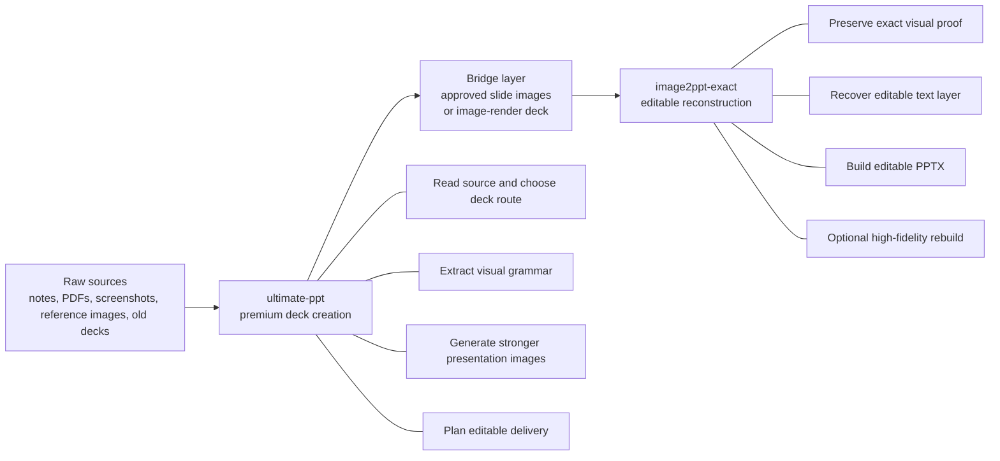

# king-of-ppt

This repository is not a thin PPT prompt wrapper.

It is a two-route presentation system that can do what most PPT skills still cannot do well:

- create premium presentation images and deck systems with real visual judgment
- carry that image-driven quality into editable PowerPoint delivery
- rebuild approved slide images into exact proof output and separate editable PPT results

In practice, this means the repo covers the whole serious workflow from presentation image generation to editable PPT reconstruction. That is the gap most market alternatives never truly close.

## 1. Make PPT with `ultimate-ppt`

<p align="center">
  
</p>

This hero image summarizes the front half of the system: the repo is designed to turn rough source material into premium presentation output, not just to autocomplete slides.

`ultimate-ppt` is built for users who need decks that look designed, not merely generated.

It does not just fill a template or decorate bullets. It can read references, understand visual grammar, build stronger covers and dense business pages, route the deck toward editable delivery, and keep the output usable for real review, revision, and handoff. Compared with typical PPT skills on the market, this is a much stronger production path: image-driven, strategy-aware, and built for decks that actually need to win.

If you want to call the skill, copy this command into Codex first:

```bash
npx skills add https://github.com/lyt-1114/king-of-ppt
```

Then copy this command into Codex:

```text
Use $ultimate-ppt to create or improve a premium PPT from my notes, screenshots, reference images, or old deck, and keep the final PPTX editable when possible.
```

<p align="center">
  
</p>

This map explains why the output quality is stronger than a normal one-shot skill. `ultimate-ppt` works like a system: source reading, visual grammar extraction, route selection, preview logic, and delivery planning all support the final deck instead of leaving the result to prompt luck.

<p align="center">
  
</p>

This comparison image is the positioning in one glance: most alternatives stop at "generate pages," while this repo is built to create presentation images, keep business content editable when needed, and survive real delivery and revision.

## How The Full System Works



This architecture view is the core thesis of the repo. The left side solves the hard problem of making better presentation images and deck systems. The right side solves the equally hard problem of turning approved image-render slides into exact proof output and usable editable PowerPoint results. Most products only cover one side; `king-of-ppt` is built to connect both.

## 2. Convert to Editable PPT with `image2ppt-exact`

<p align="center">
  
</p>

This workflow image explains the back half of the system: once a slide image set is approved, `image2ppt-exact` can preserve the exact visual result, recover editable layers, and move toward high-fidelity rebuild instead of collapsing everything into a flat screenshot deck.

`image2ppt-exact` is the route that makes this repository unusually powerful.

Most tools that claim image-to-PPT conversion stop at one of three weak endpoints: screenshots placed onto slides, rough OCR text overlays, or a vague "editable" export that falls apart the moment someone actually needs to revise the deck. `image2ppt-exact` is built for a much more serious standard.

It can preserve approved slide images as exact proof output, recover editable text layers from those slides, and push further toward high-fidelity editable rebuilds when the deck needs more than basic text recovery. In other words, it treats exact appearance, editable content, and rebuild fidelity as three separate responsibilities instead of pretending one shallow conversion step can solve all of them.

That separation is exactly why this route is stronger than most competing skills. It does not confuse "looks the same" with "is editable," and it does not confuse "OCR found some text" with "the deck is truly reconstructed." The package is designed for teams that need visual proof, editable recovery, and a believable handoff path to real PowerPoint work, which is the practical gap that most image-to-PPT tools still leave open.

If you want to call the skill, copy this command into Codex first:

```bash
npx skills add https://github.com/lyt-1114/king-of-ppt
```

Then copy this command into Codex:

```text
Use $image2ppt-exact full-rebuild to turn my approved slide-image folder into exact proof assets and an editable PPTX rebuild.
```
