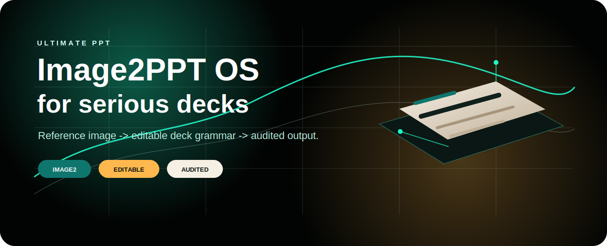
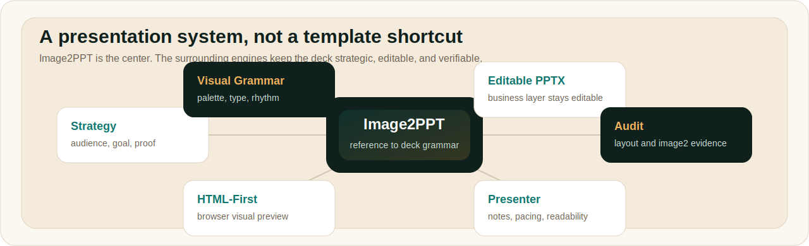
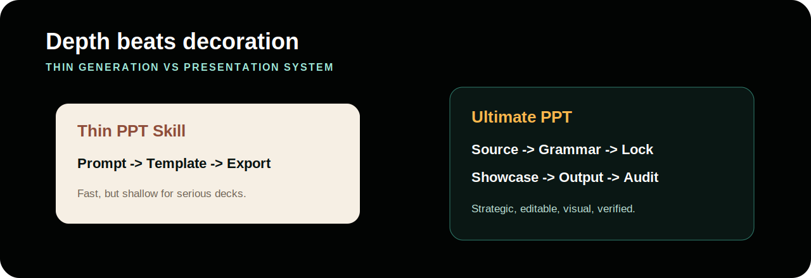
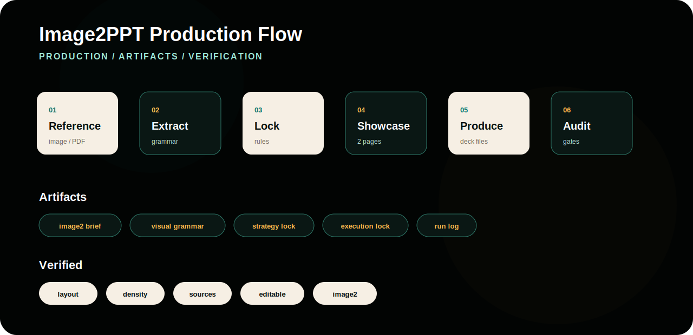
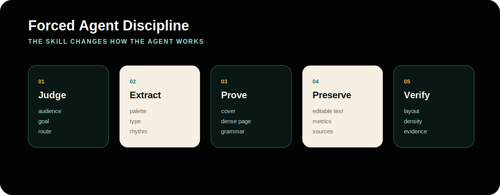
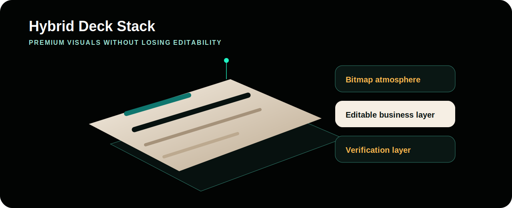

# king-of-ppt

<p align="center">
  
</p>

**king-of-ppt is not another prompt-only PPT repo.**

It is a two-skill presentation system built for work that ordinary PPT tools usually fail at:

- high-stakes decks that need stronger strategy, visual judgment, and delivery discipline
- image-driven decks that need to look designed instead of templated
- exact image-to-PPT rebuilds that need proof output and real editable reconstruction

Most comparable tools stop at "generate slides."

This repository is built for a harder standard:

- understand the source before layout
- choose the right deck route before production
- separate visual proof from editable business content
- rebuild with evidence instead of trusting screenshots
- deliver outputs that can actually survive review, editing, and handoff

```bash
npx skills add https://github.com/lyt-1114/king-of-ppt
```

## Two Skills, Two Different Advantages

| Skill | What It Does | Start Here |
| --- | --- | --- |
| `$ultimate-ppt` | Strategy-first deck creation, deck rebuilding, image-driven presentation design, keynote/sales/report workflows, and PPTX/HTML/PDF delivery planning. | [skills/ultimate-ppt/SKILL.md](skills/ultimate-ppt/SKILL.md) |
| `$image2ppt-exact` | Exact image-deck proof export, OCR editable text recovery, verified image-to-editable pipelines, and blueprint-based high-fidelity PPT rebuilds. | [skills/image2ppt-exact/SKILL.md](skills/image2ppt-exact/SKILL.md) |

## Why This Feels Stronger Than Typical PPT Tools

Ordinary tools usually optimize for one thing: producing pages fast.

This repository optimizes for **winning decks and reliable rebuilds**.

- `ultimate-ppt` is stronger when the challenge is narrative, audience fit, visual grammar, layout judgment, and multi-format delivery.
- `image2ppt-exact` is stronger when the challenge is preserving an approved look while recovering editable structure with a verifiable pipeline.

Together, they cover both sides that most alternatives split apart badly:

1. presentation intelligence
2. reconstruction fidelity

<p align="center">
  
</p>

The point of the system is not "more features."

The point is that deck creation and deck reconstruction are different problems, and this repo has a dedicated skill for each one instead of pretending one generic flow can do both.

## Skill 1: Ultimate PPT

`ultimate-ppt` is the flagship skill for people who need decks that do more than look acceptable.

It is built for:

- premium sales decks
- product launches
- keynote-style talks
- technical reports
- old-PPT rebuilds
- reference-image style transfer
- HTML-first or hybrid PPT delivery

Start here:

- [skills/ultimate-ppt/SKILL.md](skills/ultimate-ppt/SKILL.md)

Supporting files:

- `skills/ultimate-ppt/references/`
- `skills/ultimate-ppt/assets/`
- `skills/ultimate-ppt/scripts/audit_deck.py`

### What Makes `ultimate-ppt` Different

It does not begin by decorating slides.

It begins by deciding:

- who the audience is
- what decision the deck must drive
- which delivery format actually fits the job
- what visual grammar should govern the whole deck
- what must remain editable and what can stay image-driven

<p align="center">
  
</p>

Typical PPT tools are weaker because they often:

- start from a prompt instead of source material
- jump into layout before locking the story
- flatten visual quality into screenshots or decorative templates
- treat editability as an afterthought
- skip verification before delivery

`ultimate-ppt` is designed to push in the opposite direction:

- strategy first
- visual grammar before bulk production
- stronger first impression pages
- editable business content where it matters
- audit discipline before claiming success

Copyable prompt:

```text
Use ultimate-ppt to turn this reference image and product notes into a premium sales deck.
Keep the final PPTX editable, but match the image's visual mood.
```

## Skill 2: Image2PPT Exact

`image2ppt-exact` is the reproducible handoff and rebuild skill.

It exists for the cases where the user already has an approved image-render deck, screenshot deck, or slide-image sequence and needs something stronger than "put the image on a slide."

Start here:

- [skills/image2ppt-exact/SKILL.md](skills/image2ppt-exact/SKILL.md)

Implementation package:

- [packages/image2ppt-exact/README.md](packages/image2ppt-exact/README.md)
- `packages/image2ppt-exact/src/image2ppt_exact/`

### What Makes `image2ppt-exact` Different

Most image-to-PPT tools stop at visual wrapping.

`image2ppt-exact` is built around one practical main route:

1. exact proof output
2. OCR-backed editable text recovery
3. optional blueprint-based high-fidelity rebuild
4. unified verification logs

That means it can preserve an approved visual baseline while still moving toward real editability.

<p align="center">
  
</p>

In practice, this skill is stronger than most similar tools because it does not confuse these very different outputs:

- pixel-faithful proof
- editable text recovery
- high-fidelity native PPT reconstruction

Those are separate layers, and this skill gives each one a defined route instead of collapsing everything into one vague "editable export" claim.

Copyable skill:

```text
Use image2ppt-exact for exact image-deck proof output, OCR-based editable text recovery, and blueprint-based high-fidelity PPT rebuilds.
```

## The Core Thesis

Image2PPT here does not mean "use images in slides."

It means reading a visual source like a system:

1. preserve what must stay exact
2. recover what should become editable
3. rebuild only the layers that justify the extra effort
4. prove the result with logs and counts

<p align="center">
  
</p>

That is why these skills can outperform many same-category tools:

- they force route selection instead of pretending every deck is the same
- they force visual judgment instead of template autopilot
- they force editability decisions early
- they force verification instead of relying on preview vibes

## Capability Stack

<p align="center">
  
</p>

- **Strategy and audience fit**: choose the right deck architecture before slide production.
- **Visual grammar extraction**: derive palette, type hierarchy, rhythm, and composition from references instead of tracing screenshots blindly.
- **Exact proof output**: preserve approved image-render decks with reproducible proof assets.
- **Editable recovery**: rebuild OCR text as native PPT text boxes where editability matters.
- **High-fidelity rebuild path**: use blueprint or structured SVG routes to move toward native objects.
- **Verification discipline**: keep logs, counts, and audit signals instead of vague success claims.

## Which One Should You Open First

Open `ultimate-ppt` if you need:

- a better deck
- a stronger story
- a stronger visual system
- a more persuasive final presentation

Open `image2ppt-exact` if you need:

- exact image-deck proof output
- OCR text recovery
- editable PPT reconstruction from image slides
- blueprint-based high-fidelity rebuilds

## Install

```bash
npx skills add https://github.com/lyt-1114/king-of-ppt
```

## Repository Structure

```text
skills/
  ultimate-ppt/
  image2ppt-exact/
packages/
  image2ppt-exact/
docs/
  readme/
  internal/
```

## Internal Notes

Repository planning and design records are kept under `docs/internal/`.

## License

MIT
